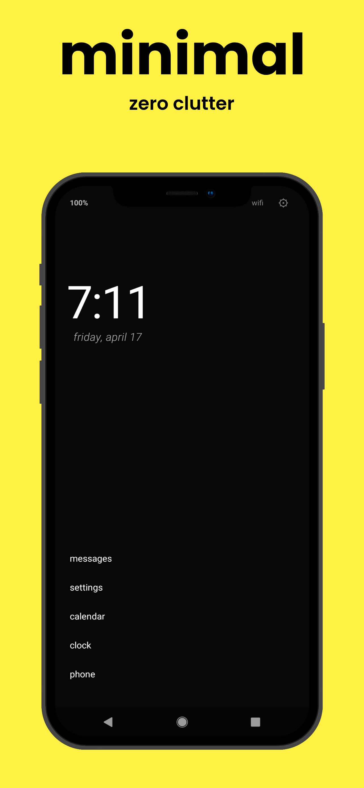
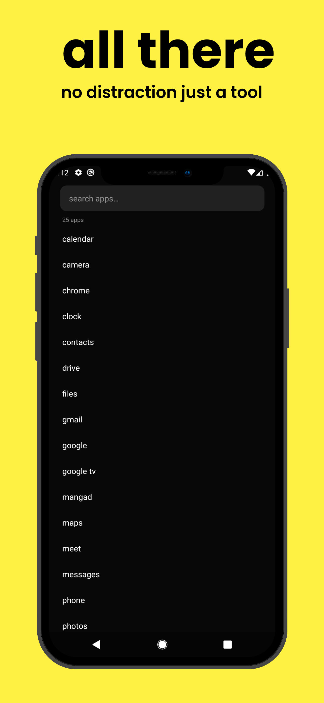
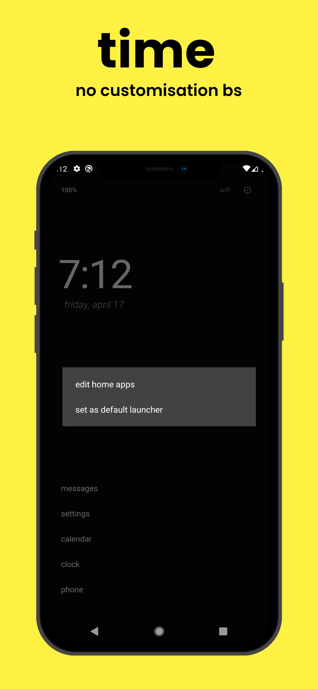
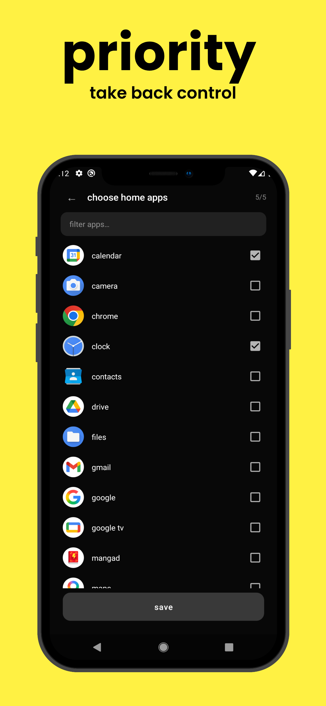
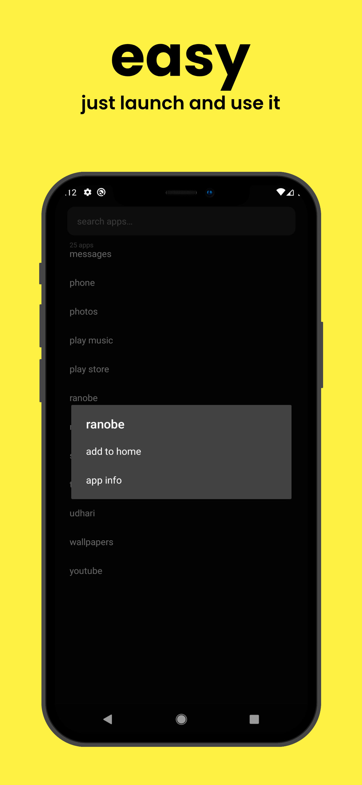

# tiny

A minimal Android launcher built around the idea that your phone's home screen should get out of the way.

No feeds. No widgets. No noise. Just your apps, the time, and silence.

---

--- 

## Screenshots

  
  
  
  
  

---

## Features

**Clock-first home screen**
The time and date sit front and center — large, thin, and readable at a glance. A breathing vignette gives the screen a subtle, immersive depth.

**Pinned apps**
Pin up to 5 apps at the bottom of the home screen. Tap to open, long-press to remove or view info. First launch auto-populates sensible defaults if you haven't chosen yet.

**App drawer**
Swipe left or right from anywhere on the home screen to open a full, searchable list of every installed app. Instant filter as you type.

**Alarm preview**
If you have an alarm set, tiny shows it quietly below the date so you never lose track of it.

**Battery & connectivity at a glance**
Battery percentage (with a charging indicator) and your current connection type sit in the top bar — present without being loud.

**Status bar**
Auto-hides for a truly edge-to-edge, distraction-free home screen. Swipe down to peek, it hides itself again.

**System-aware insets**
Correctly handles status bar and navigation bar insets on all modern Android versions — nothing hides behind system chrome.

**Dark first**
Designed for dark environments. Pure dark background, muted text hierarchy, no jarring whites.

---

## Philosophy

> Most launchers try to do more. tiny tries to do less.

The home screen is the most-opened surface on your phone. tiny keeps it calm — no algorithmic suggestions, no app badges competing for attention, no bloat. Open your phone, see the time, open what you came for, move on.

---

## Requirements

- Android 8.0 (API 26) or higher
- No special permissions beyond what a launcher needs

---

## Privacy

tiny collects no data. See [PRIVACY.md](PRIVACY_POLICY.md) for the full policy.
